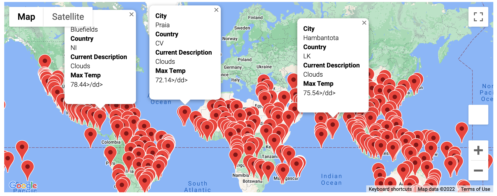
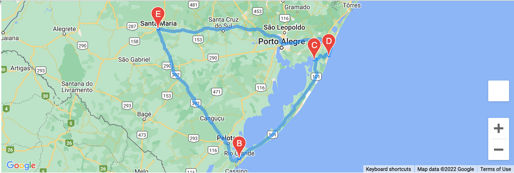
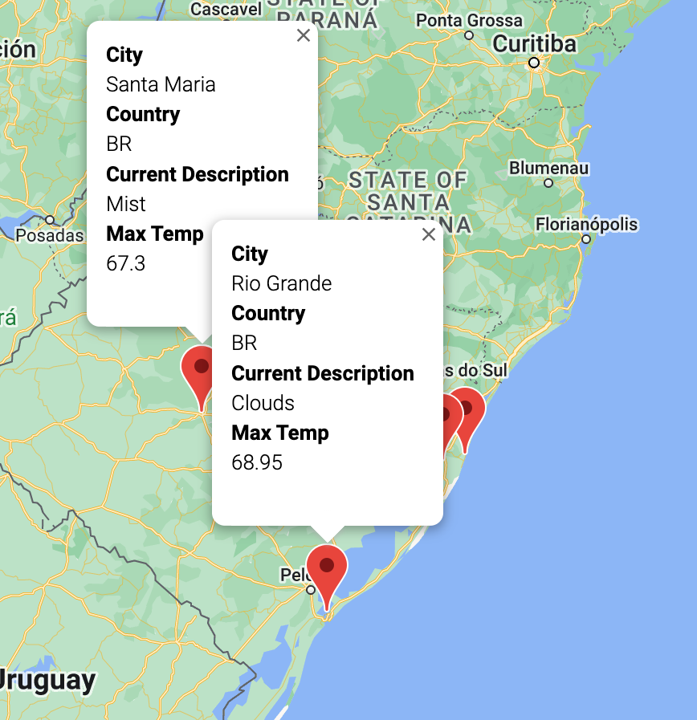

# World_Weather_Analysis
## Purpose of World Weather Analysis
The [**first**] purpose of this analysis was to generate our own set of 2,000 random latitudes and longitudes using OpenWeatherMap and an API call. By doing this, we will create a new dataframe with numerous variables: city name, country, latitude, longitude, humidity, cloudiness, wind speed, and the current weather description. The [**second**] purpose was to use our new weather database and use it to identify favorable travel spots and hotels in the surrounding areas. With this information, we were able to create marker layer map to display the city, country, max temp, and weather description. The [**last**] purpose was to use Google Directions API to create a travel itinerary using four random cities within the same country and also make a marker layer map.

### Below is the CSV file displaying the random cities generated followed by pictures displaying the maps.

*This is the map of all randomized cities showing two markers as examples.*

*This is the map displaying the four cities in a random country (Brazil).*

*This is the last map displaying two of the four cities with markers.*
